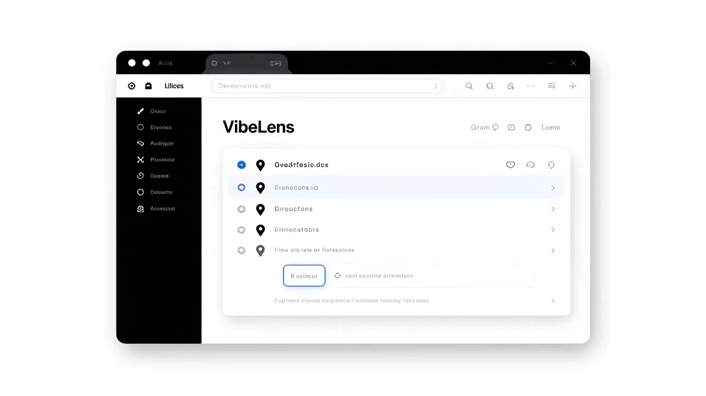
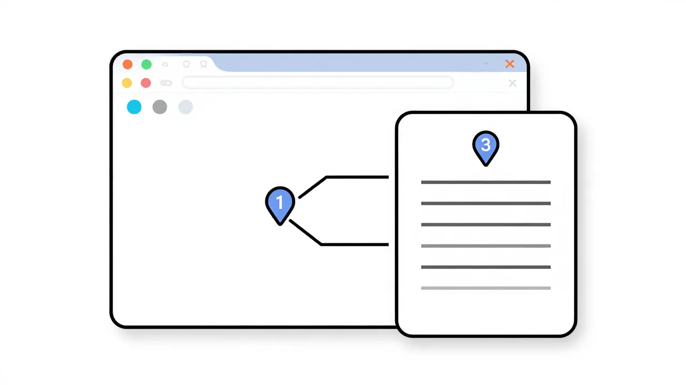
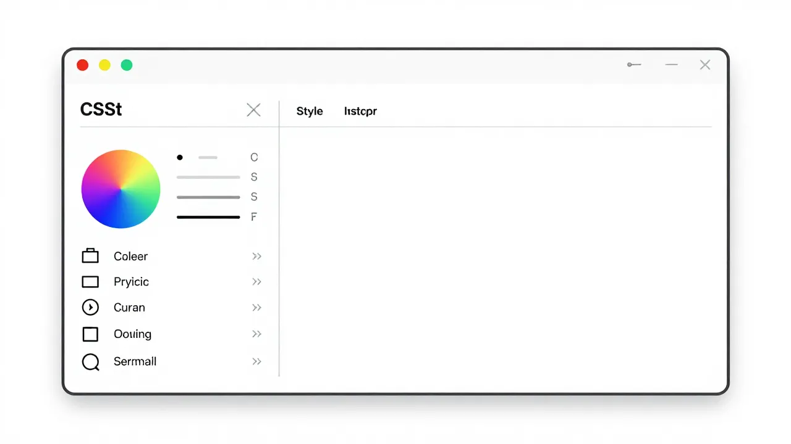
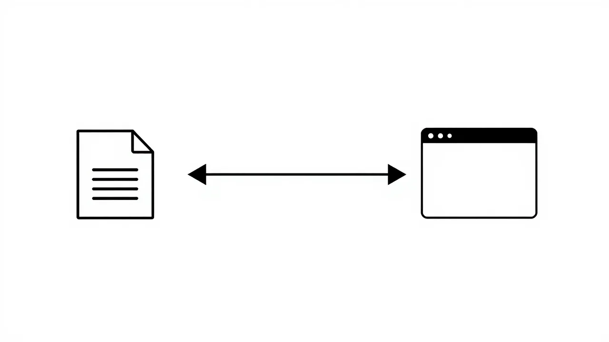
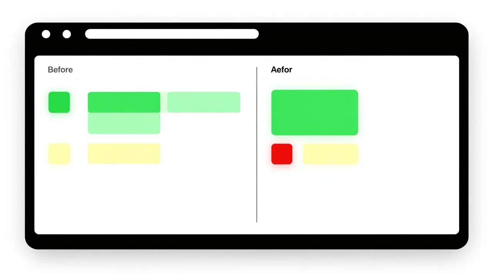

# VibeLens — Product Launch Brochure

> **A visual co-pilot for vibe coding — see changes, annotate problems, tweak styles, all in the browser.**

---

## Brand Identity

| Attribute       | Value                                      |
|-----------------|---------------------------------------------|
| **Product**     | VibeLens                                    |
| **Tagline**     | See it. Pin it. Fix it.                     |
| **Category**    | Developer Tools / Browser Extension + CLI   |
| **License**     | MIT (Open Source)                            |
| **Author**      | Shandar Junaid / Affordance Design Studios  |
| **Website**     | affordance.design                           |
| **Repository**  | github.com/shandar/VibeLens                 |

---

## The Problem

AI-assisted development has a friction loop that costs developers 10+ minutes per iteration:

1. **Context Switching** — AI generates code, but you alt-tab to browser to see output
2. **Imprecise Feedback** — Describing visual problems in words is lossy ("make the padding bigger")
3. **Small Tweaks Are Expensive** — A 2px spacing fix requires another full AI prompt cycle
4. **No Visual History** — Hard to compare what changed between AI iterations
5. **Fragmented Tooling** — No single tool combines preview + annotate + edit + sync

**The result:** What should take 30 seconds takes 10 minutes. Visual feedback to AI tools is vague, imprecise, and slow.

---

## The Solution

VibeLens is a **browser extension + local CLI bridge** that closes the visual-coding feedback gap.

### Three Core Actions

#### 1. SEE — Live Preview Panel


A persistent side panel in Chrome that shows your dev server output in real-time. No more alt-tabbing between editor and browser.

- **Auto-detects** your local dev server (React, Vue, Svelte, plain HTML)
- **Hot-reload aware** — updates instantly when files change
- **Viewport controls** — toggle between mobile, tablet, and desktop
- **Visual diff overlay** — color-coded highlights show what changed

#### 2. PIN — Click-to-Annotate


Click any element on the page, drop a pin, type a note. Annotations are anchored to DOM elements — they survive reloads, resizes, and layout shifts.

- **DOM-anchored pins** — not pixel coordinates, but CSS selectors
- **Rich context capture** — each annotation includes source file, computed styles, and a screenshot
- **Export formats** — JSON, Markdown, or AI-ready prompt format
- **Keyboard shortcut** — Cmd+Shift+A toggles annotation mode

#### 3. FIX — Direct CSS Manipulation


Click an element, adjust CSS visually — colors, spacing, typography — and watch changes write back to your source files through AST-aware code modification.

- **Visual controls** — color pickers, spacing sliders, font selectors
- **Source sync** — changes write to CSS, JSX inline styles, Tailwind classes, Vue SFC `<style>`, styled-components
- **AST-aware** — never corrupts code, context-aware modifications only
- **Instant preview** — see changes before committing to source

---

## How It Works



### Two-Component System

```
Browser Extension (Chrome)  ←→  Bridge Server (CLI)
  ● Side panel preview       ←→  ● File watcher (chokidar)
  ● Annotation system        ←→  ● Source map resolver
  ● Style inspector          ←→  ● AST code writer
  ● Export engine             ←→  ● Framework adapters
         ↕ WebSocket (ws://localhost:9119)
```

**Setup takes under 2 minutes:**

```bash
# Step 1: Install the extension from Chrome Web Store
# Step 2: Start the bridge in your project
npx vibelens

# That's it. The extension auto-connects.
```

The bridge binds to `127.0.0.1` only — your code never leaves your machine. No telemetry, no external requests.

---

## Visual Diff



After every code change, VibeLens highlights exactly what changed in the UI:

| Color    | Meaning                |
|----------|------------------------|
| Green    | Newly added elements   |
| Yellow   | Modified (style/content) |
| Red      | Removed elements       |

Toggle the diff overlay with **Cmd+Shift+D**. Compare iterations instantly instead of squinting at two browser tabs.

---

## The AI Feedback Loop

VibeLens transforms the AI-assisted development workflow from vague to precise:

### Without VibeLens (10+ minutes)
```
1. Ask AI: "Build a dashboard"
2. AI generates code
3. Alt-tab to browser
4. Squint at the result
5. Type: "The spacing looks off and the colors are wrong"
6. AI guesses what you mean
7. Repeat 3-4 times
```

### With VibeLens (under 2 minutes)
```
1. Ask AI: "Build a dashboard"
2. AI generates code → VibeLens shows preview with diff
3. Spot 3 issues → annotate with exact selectors + screenshots
4. Fix 1 issue directly via CSS inspector (2px padding fix)
5. Export remaining 2 as AI prompt with precise context
6. AI makes targeted, accurate fixes
7. Done.
```

**Precision replaces guesswork. Selectors replace descriptions.**

---

## Competitive Landscape

| Capability             | VibeLens | Chrome DevTools | VisBug  | Claude Preview |
|------------------------|----------|-----------------|---------|----------------|
| Persistent Side Panel  | Yes      | No              | No      | Yes            |
| Click-to-Annotate      | Yes      | No              | No      | No             |
| Annotation Export       | Yes      | No              | No      | No             |
| Visual Diff             | Yes      | No              | No      | No             |
| CSS Visual Editing      | Yes      | Yes             | Yes     | No             |
| Write Back to Source    | Yes      | No              | No      | No             |
| AI Tool Integration     | Any tool | No              | No      | Claude only    |
| Editor Agnostic         | Yes      | N/A             | N/A     | No             |
| Open Source              | MIT      | N/A             | Yes     | No             |

---

## Technical Specifications

### Extension
| Spec               | Value                        |
|---------------------|------------------------------|
| Platform            | Chrome Manifest V3           |
| UI Framework        | Preact (3KB gzipped)         |
| State Management    | Zustand                      |
| Build System        | Vite + CRXJS                 |
| Bundle Budget       | < 500KB gzipped              |
| Memory Budget       | < 50MB                       |

### Bridge (CLI)
| Spec               | Value                        |
|---------------------|------------------------------|
| Runtime             | Node.js 18+                  |
| HTTP Server         | Fastify                      |
| WebSocket           | ws library                   |
| File Watcher        | chokidar                     |
| CSS Parser          | PostCSS                      |
| JS/TS AST           | @babel/parser + traverse     |
| Startup Time        | < 2 seconds                  |

### Security
- Bridge binds to **127.0.0.1 only** — never exposed to the network
- **No external network requests** — everything stays local
- **AST-aware writes** — never string replacement, prevents code corruption
- **Path containment** — code writer restricted to project directory
- **No telemetry** without explicit opt-in

---

## Framework Support

### Phase 1 (Current)
- React + plain HTML/CSS

### Phase 2-4 (Planned)
- Vue (SFC support)
- Svelte
- Tailwind CSS (class reverse-lookup)
- Angular
- styled-components / CSS Modules

---

## Roadmap

| Phase | Timeline    | Milestone                              | Version |
|-------|-------------|----------------------------------------|---------|
| 1     | 4-6 weeks   | MVP: Preview + Annotate                | v0.1.0  |
| 2     | 3-4 weeks   | Visual Editing + Source Sync            | v0.2.0  |
| 3     | 3-4 weeks   | Timeline + Screenshot History           | v0.3.0  |
| 4     | 3-4 weeks   | Framework Adapters + Firefox            | v0.4.0  |
| 5     | 2-3 weeks   | AI Tool Integration + Webhook API       | v0.5.0  |

---

## Performance Budgets

| Metric                    | Target      |
|---------------------------|-------------|
| Time to first annotation  | < 3 seconds |
| Visual tweak → source sync | < 500ms    |
| Annotation → AI feedback  | < 30 seconds |
| DOM diff computation       | < 300ms    |
| Source map resolution      | < 200ms    |
| Bridge startup             | < 2 seconds |
| WebSocket latency          | < 50ms     |

---

## Distribution

### For Terminal Users
```bash
npx vibelens
# Works with Claude Code, Vim, Emacs, any terminal editor
```

### For VS Code / Cursor Users
```
Install the VibeLens VS Code extension
# Bridge starts automatically when you open a project
```

### For Everyone
```
Install VibeLens from the Chrome Web Store
# Works with any dev setup that has a local dev server
```

---

## Who It's For

### Vibe Coders
Non-expert developers using AI as their primary coding method. VibeLens gives you visual feedback and precise control without needing to understand DevTools.

### AI-Assisted Developers
Experienced devs using AI as an accelerator. You want direct control for cosmetic tweaks without burning another AI prompt cycle on a 2px fix.

### Design-Aware Developers
Frontend devs who care about visual polish. Annotate, measure, and tweak until every pixel is right — then sync to source.

### Team Reviewers
Give visual feedback on AI-generated code with pinned annotations instead of vague Slack messages like "the button looks weird."

---

## Open Source

VibeLens is **MIT-licensed** from day one. The core tool is free and open-source forever.

**Future monetization** (not yet):
- VibeLens Cloud — team annotation sync, shared visual history
- CI/CD integration — visual regression testing
- Enterprise tier — priority support, custom framework adapters

The open-source core will never be gated.

---

## Get Started

```bash
# 1. Install the Chrome extension
# → Chrome Web Store (coming soon)

# 2. Start the bridge
npx vibelens

# 3. Open your project in the browser
# → VibeLens connects automatically
# → Open the side panel (click the VibeLens icon)
# → Start annotating
```

---

## Links

- **GitHub:** [github.com/shandar/VibeLens](https://github.com/shandar/VibeLens)
- **Website:** [affordance.design](https://affordance.design)
- **Author:** [Shandar Junaid](https://shandarjunaid.com)
- **Email:** hello@affordancedesign.in
- **License:** MIT

---

*Built by Affordance Design Studios — Human-centered design, AI-powered outcomes.*
